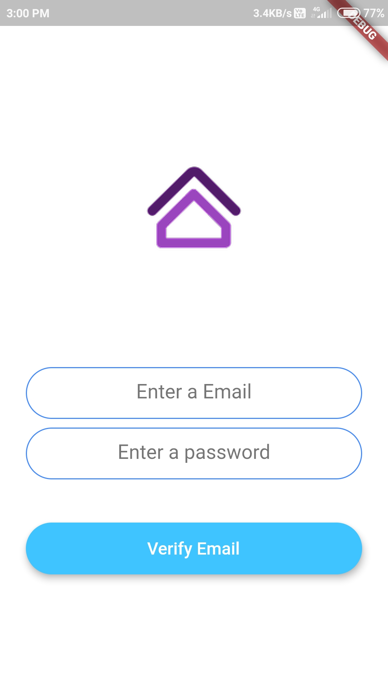
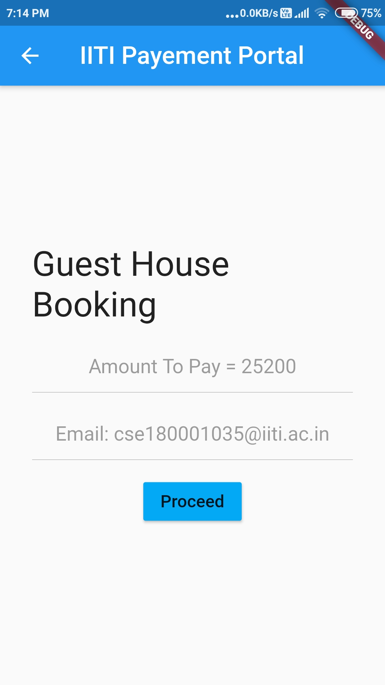

# Guest House Booking Platform for IITI Guest House
## Project done under Software Engineering Lab Course

## Screenshots
 
Homescreen
 

  

Registration Screen
 

  

Login Screen
 

  

Drawer Screen
 

  

Guest House Screen
 

  

Bookings Done
 

  

Date Selection
 

  

Hospitality Screen
 

  

Payment Confirmation Screen
 

  

Payment Screen
 

  

Profile Screen
 

  

Rooms Detail Screen
 

  

Rooms Selection Screen
 

  

Authentication
 

  

Firebase Database
 

  

 

  

Firestore
 

  

 

  

